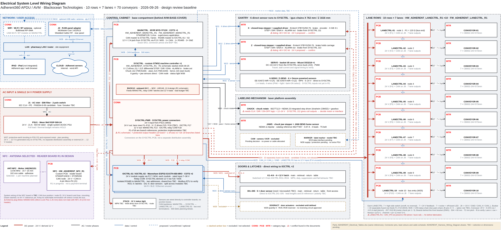

<p align="center">
  
</p>

<p align="center">
  <a href="SYS/ADHERENT_Electrical_Tables.xlsx"><strong>Component spreadsheet</strong></a> &nbsp; · &nbsp;
  <a href="SYS/ADHERENT_System_Wiring_Diagram.png"><strong>System diagram</strong></a> &nbsp; · &nbsp;
  <a href="SYS/ADHERENT_Harness_Wiring_Diagram.png"><strong>Harness diagram</strong></a> &nbsp; · &nbsp;
  <a href="SYS/ADHERENT_Design_Review.pptx"><strong>Design presentation</strong></a> &nbsp; · &nbsp;
  <a href="SYS/ADHERENT_Project_Review.md"><strong>Review findings</strong></a>
</p>

## The project

Adherent360 APDU is an automated pharmaceutical dispensing system built around **70 conveyor lanes**, a gantry, a labeling mechanism and monitored access doors. This repository holds the electrical architecture, component registers, mechanical references and planned hardware/firmware work for the system.

**Current system documents use stable, revision-free filenames.** Electrical design documentation is maintained by **Blackocean Technologies** in the **Microver Electronics / Adherent** repository.

> [!IMPORTANT]
> This is a design-review baseline. Components marked **TBC**, **candidate** or **HOLD** still need selection or engineering validation. LANECTRL Altium design files and exports are present; production release is not confirmed. Firmware/application implementations have not been added yet.

## 🗂️ Start with the documents

- **[Components and part numbers](SYS/ADHERENT_Electrical_Tables.xlsx)** — One sheet with 32 grouped entries, matching diagram references, part numbers, clickable source and CAD links, locations and rough dimensions.
- **[Mechanical BOM](MEC/ADHERENT_Mechanical_BOM.xlsx)** — gantry parts and mechanical procurement references.
- **[Design review presentation](SYS/ADHERENT_Design_Review.pptx)** — architecture, confirmed decisions and questions to resolve.
- **[Project decisions](brain.md)** — working assumptions, naming conventions and current scope.

Included components and interface positions are identified separately from purchased assemblies. Do not sum every spreadsheet row as an independent purchase quantity.

## 🔌 Electrical system

<a href="SYS/ADHERENT_System_Wiring_Diagram.png">
  
</a>

**[Open full-size PNG](SYS/ADHERENT_System_Wiring_Diagram.png)** · **[Edit in draw.io](SYS/ADHERENT_System_Wiring_Diagram.drawio)**

**Pin-level harness:** [ADHERENT_Harness_Wiring_Diagram](SYS/ADHERENT_Harness_Wiring_Diagram.drawio) ([PNG](SYS/ADHERENT_Harness_Wiring_Diagram.png)) shows every device with its product photo, connector pins and lead colours. Its draw.io layers are the build steps (AC → 24 V → branches → CAN → Ethernet / RS485 → drives → labeling → sensors → doors → lane rows), and two further pages hold the cable schedule and the connector reference. Interface conflicts found in the documents are flagged in red there.

Red, bold corner tags identify **CONN** connectors, **PCB** controller boards and **MTR** motor assemblies. These are category labels; the existing board, connector and cable identifiers remain the references used in the schedules.

- **Power:** one Mean Well **RSP-500-24**, rated 24 V / 21 A / 504 W. SYSCTRL generates the derived 12 V rail on board; converter selection and the full load budget remain open.
- **Control network:** CAN links MAINCTRL, SYSCTRL and the ten LANECTRL boards. The two IOCTRL modules (IOCTRL-01, IOCTRL-02) use a separate RS485 connection to MAINCTRL; bus topology and addressing are TBC.
- **Site connection:** McMaster-Carr **1422N13** rear-panel Ethernet adapter, quantity one. The iPad is external and uses the site network.
- **Direct sensors:** six gantry sensors connect to SYSCTRL; five door sensors connect to IOCTRL (split between the two modules TBC). **No junction boxes.**
- **IOCTRL power:** 24 V supplies each module; a separate SYSCTRL-derived 12 V feed supplies the latch relay contacts. Feed branches for the second module are TBC.

### NFC antenna

**Molex 1462362151** is selected: 13.56 MHz, 15 x 15 mm, adhesive mount, 102 mm cable. The NFC reader/front-end, host interface and power budget remain open under O16; no payment terminal is selected. [Supplier listing](https://www.digikey.com/en/products/detail/molex/1462362151/15204370).

The presentation covers the used system interfaces and current SYSCTRL/NFC architecture. Use the single-sheet parts workbook for part numbers, source links and mounting references.

## 🧩 Four controller roles

### 🟦 MAINCTRL — supervisory control

**MYIR MYD-YF13X · purchased board · 1 assembly**  
Planned Linux application, site/server communication, CAN master and RS485 master. Exact order code, populated interfaces and BSP require confirmation. [Hardware folder →](HW/HW_ADHERENT_MAINCTRL_R1)

### 🟪 SYSCTRL — machine control

**Custom STM32 PCB · 1 assembly**  
Gantry and labeling interfaces, sensors, servo and auxiliary outputs, plus onboard 24 V-to-12 V conversion. [Hardware folder →](HW/HW_ADHERENT_SYSCTRL_R1)

### 🟩 LANECTRL — conveyor rows

**Custom STM32G0B1 PCB · 10 assemblies · R1 placed and routed, not released**  
Seven conveyor channels per row, switched on/off by two TPS4H160 high-side switches with current sensing and fault reporting. Each lane has a PCB-mounted rocker switch that is hardware-ANDed with the MCU enable, a 24 V dry-contact feedback input and an off-board lane LED. Each board takes 24 V and CAN on one 4-pin Micro-Fit (+24 V / GND / CANH / CANL). Lane connectors are 3-pin Micro-Fit (24 V / GND / SIGNAL). The CAN node ID is set with a DIP switch and termination with a jumper. The PCB is 504 × 60 mm with 4 layers. Ten rows provide **70 channels**. [Hardware folder →](HW/HW_ADHERENT_LANECTRL_R1)

> [!WARNING]
> LANECTRL R1 schematic: the protected 24 V rail (`+24V_PR`) is not connected to the driver/buck rail (`VM`). Fix this and regenerate the netlist, BOM and PDF before fabrication. See [brain.md](brain.md#lanectrl--custom-pcb-quantity-10).

### 🟧 IOCTRL — door inputs and latch outputs

**Waveshare ESP32-S3-ETH-8DI-8RO · purchased board · 2 assemblies (IOCTRL-01, IOCTRL-02)**  
Eight relays and eight isolated digital inputs per module, 16 of each in total. The baseline allocates four latch outputs and five door-sensor inputs; their split between the two modules and the second module's additional functions are TBC. RS485 firmware behavior needs validation. [Hardware folder →](HW/HW_ADHERENT_IOCTRL_R1)

**Two custom PCB designs, eleven custom assemblies, three purchased controller assemblies (MAINCTRL ×1, IOCTRL ×2).**

## ⚙️ Mechanical integration

- [Machine assembly STEP](MEC/AVM-FRAME-MAINASSEMBLY_V4.STEP)
- [LANECTRL front-bracket DWG](MEC/01_CAD_MODELS/Draw%C4%B1ng/LANE%20DRAWING%20SPACE%20FOR%20UMIT.DWG)
- [Board STEP models and qualification notes](MEC/Board_STEP_Models/README.md)
- [Conveyor supplier reference](SYS/Conveyor%20belt%28CB002-24V-573mm%29.pdf)

The front bracket follows the supplied DWG. LANECTRL R1 is 504 × 60 mm with 8 × M3 holes and switches at a 72 mm lane pitch; its fit against the DWG, switch/LED alignment and cable clearance still need checking. Provisional reconstructed STEP models support placement studies and are not verified fabrication geometry.

## 📁 Repository map

```text
Adherent/
├── SYS/       Current diagram, spreadsheets, presentation and references
├── HW/        SYSCTRL, MAINCTRL, LANECTRL and IOCTRL hardware folders
├── FW/        Planned embedded firmware scope
├── SW/        Planned application and host-tool scope
├── MEC/       Machine CAD and mechanical references
├── docs/      Repository presentation assets
└── brain.md   Project decisions and working assumptions
```

The HW folders use the four board identifiers. LANECTRL contains the Altium schematics, routed PCB, libraries, BOMs and STEP/PDF exports (the netlist, BOM and PDF exports predate the latest schematic/PCB edits). Altium work on SYSCTRL has started; MAINCTRL and IOCTRL are purchased boards. See [firmware scope](FW/README.md) and [software scope](SW/README.txt) for implementation status. Large CAD files use **Git LFS**; install Git LFS and run `git lfs pull` after cloning to obtain available tracked CAD content.

## 🛠️ Next engineering milestones

- Confirm the gantry driver/brake interfaces and performance at 24 V.
- Select and validate the SYSCTRL 12 V converter and complete the power budget.
- Fix the LANECTRL R1 `+24V_PR`/`VM` rail error, decide the single-connector CAN harness (T-splice or second connector) and check the board against the bracket DWG.
- Conveyor current measured on the bench (190 mA running, ≈0.5 A stalled). Confirm the feedback reference on a real harness and finish the firmware stall/timeout logic.
- Coordinate motor drivers, transient protection, fuses, wiring and connectors. Resolve the harness conflicts flagged in the harness diagram: CHUCK 6627T113 is an integrated step driver (SYSCTRL J12 gives coil outputs), the NFC antenna plug does not fit NFC J4, SYSCTRL R1 has 7 protected output headers for about 18–19 branches, and LANECTRL J8 needs a CAN splice rule.
- Finalize marker, latch and sensor selections; confirm direct harness lengths and bracket fit.
- Implement and test firmware, startup/fault behavior and system integration.

See [project decisions](brain.md) for unresolved engineering work. The [earlier engineering review](SYS/ADHERENT_Project_Review.md) records the detailed checks; those schedules remain recoverable in Git history.

## Working conventions

- Keep only the current system-document revision in `SYS`; recover superseded revisions from Git history.
- Update the editable `.drawio` and its PNG together. Keep component quantities and identifiers aligned with the single customer parts sheet.
- Use `HW_ADHERENT_<BOARD>_R<REV>`, `FW_ADHERENT_<BOARD>_R<REV>` and the established `WR_ADHERENT_...` harness identifiers.
- Keep selected parts, candidates, excluded options and verified results clearly distinguished.

---

<p align="center"><strong>Adherent360 APDU</strong><br>System engineering by Blackocean Technologies</p>
