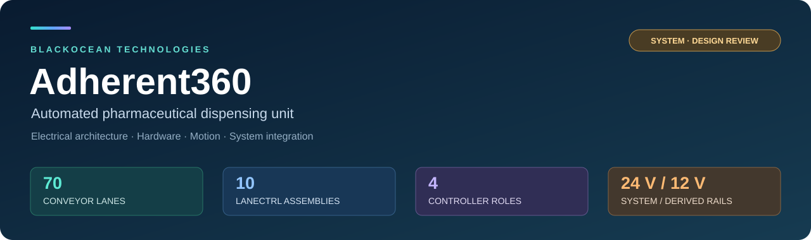
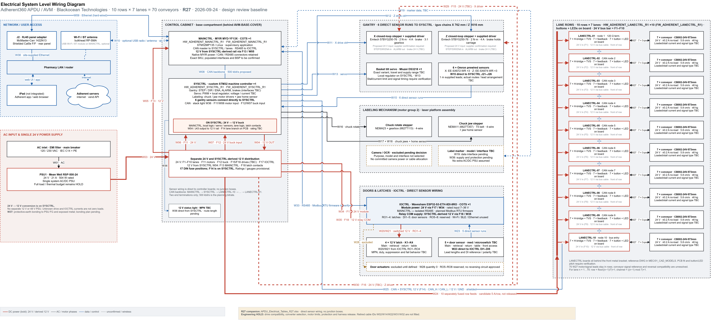

<p align="center">
  
</p>

<p align="center">
  <a href="SYS/ADHERENT_System_Diagram_Components_R27.xlsx"><strong>Component spreadsheet</strong></a> &nbsp; · &nbsp;
  <a href="SYS/Electrical_System_Level_Wiring_Diagram_R27.png"><strong>System diagram</strong></a> &nbsp; · &nbsp;
  <a href="SYS/APDU_Design_Review_Questions_R27.pptx"><strong>Design presentation</strong></a> &nbsp; · &nbsp;
  <a href="SYS/PROJECT_REVIEW_R27.md"><strong>Review findings</strong></a>
</p>

## The project

Adherent360 APDU is an automated pharmaceutical dispensing system built around **70 conveyor lanes**, a gantry, a labeling mechanism and monitored access doors. This repository holds the electrical architecture, component registers, mechanical references and planned hardware/firmware work for the system.

**Current baseline: R27.** Electrical design documentation is maintained by **Blackocean Technologies** in the **Microver Electronics / Adherent** repository.

> [!IMPORTANT]
> This is a design-review baseline. Components marked **TBC**, **candidate** or **HOLD** still need selection or engineering validation. Firmware/application implementations and production PCB designs have not been added yet.

## 🗂️ Start with the documents

- **[Components and part numbers](SYS/ADHERENT_System_Diagram_Components_R27.xlsx)** — 82 component/interface rows with manufacturer, part number, quantity, selection status and sources. Covers every component block in the system diagram.
- **[Electrical BOM and schedules](SYS/APDU_Electrical_Tables_R27.xlsx)** — boards, connectors, harnesses, fuses, power calculations and open engineering items.
- **[Mechanical BOM](SYS/VENDING%20MACHINE%20GANTRY%20BILL%20OF%20MATERIALS%20-%20OFF%20THE%20SHELF%20COMPONENTS.xlsx)** — gantry parts and mechanical procurement references.
- **[Design review presentation](SYS/APDU_Design_Review_Questions_R27.pptx)** — architecture, confirmed decisions and questions to resolve.
- **[Project decisions](brain.md)** — working assumptions, naming conventions and current scope.

Included components and interface positions are identified separately from purchased assemblies. Do not sum every spreadsheet row as an independent purchase quantity.

## 🔌 Electrical system

<a href="SYS/Electrical_System_Level_Wiring_Diagram_R27.png">
  
</a>

**[Open full-size PNG](SYS/Electrical_System_Level_Wiring_Diagram_R27.png)** · **[Edit in draw.io](SYS/Electrical_System_Level_Wiring_Diagram_R27.drawio)**

Red, bold corner tags identify **CONN** connectors, **PCB** controller boards and **MTR** motor assemblies. These are category labels; the existing board, connector and cable identifiers remain the references used in the schedules.

- **Power:** one Mean Well **RSP-500-24**, rated 24 V / 21 A / 504 W. SYSCTRL generates the derived 12 V rail on board; converter selection and the full load budget remain open.
- **Control network:** CAN links MAINCTRL, SYSCTRL and the ten LANECTRL boards. IOCTRL uses a separate RS485 connection to MAINCTRL.
- **Site connection:** McMaster-Carr **1422N13** rear-panel Ethernet adapter, quantity one. The iPad is external and uses the site network.
- **Direct sensors:** six gantry sensors connect to SYSCTRL; five door sensors connect to IOCTRL. **No junction boxes.**
- **IOCTRL power:** 24 V supplies the module; a separate SYSCTRL-derived 12 V feed supplies the latch relay contacts.

### NFC antenna

**Molex 1462362151** is selected: 13.56 MHz, 15 x 15 mm, adhesive mount, 102 mm cable. The NFC reader/front-end, host interface and power budget remain open under O16; no payment terminal is selected. [Supplier listing](https://www.digikey.com/en/products/detail/molex/1462362151/15204370).

The presentation is an earlier review snapshot. Use the current diagram and electrical workbook for the merged SYSCTRL topology and NFC selection.

## 🧩 Four controller roles

### 🟦 MAINCTRL — supervisory control

**MYIR MYD-YF13X · purchased board · 1 assembly**  
Planned Linux application, site/server communication, CAN master and RS485 master. Exact order code, populated interfaces and BSP require confirmation. [Hardware folder →](HW/HW_ADHERENT_MAINCTRL_R1)

### 🟪 SYSCTRL — machine control

**Custom STM32 PCB · 1 assembly**  
Gantry and labeling interfaces, sensors, servo and auxiliary outputs, plus onboard 24 V-to-12 V conversion. [Hardware folder →](HW/HW_ADHERENT_SYSCTRL_R1)

### 🟩 LANECTRL — conveyor rows

**Custom PCB · 10 assemblies**  
Seven conveyor channels, seven buttons and seven LEDs per row. Ten rows provide **70 channels**; buttons and LEDs are integrated into LANECTRL. [Hardware folder →](HW/HW_ADHERENT_LANECTRL_R1)

### 🟧 IOCTRL — door inputs and latch outputs

**Waveshare ESP32-S3-ETH-8DI-8RO · purchased board · 1 assembly**  
Eight relays and eight isolated digital inputs. The baseline allocates four latch outputs and five door-sensor inputs; RS485 firmware behavior needs validation. [Hardware folder →](HW/HW_ADHERENT_IOCTRL_R1)

**Two custom PCB designs, eleven custom assemblies, two purchased controller assemblies.**

## ⚙️ Mechanical integration

- [Machine assembly STEP](MEC/AVM-FRAME-MAINASSEMBLY_V4.STEP)
- [LANECTRL front-bracket DWG](MEC/01_CAD_MODELS/LANE%20DRAWING%20SPACE%20FOR%20UMIT.DWG)
- [Board STEP models and qualification notes](MEC/Board_STEP_Models/README.md)
- [Conveyor supplier reference](SYS/Conveyor%20belt%28CB002-24V-573mm%29.pdf)

The front bracket follows the supplied DWG. PCB mounting, button/LED alignment and cable clearance still need a fit check. Provisional reconstructed STEP models support placement studies and are not verified fabrication geometry.

## 📁 Repository map

```text
Adherent/
├── SYS/       Current diagram, spreadsheets, presentation and references
├── HW/        SYSCTRL, MAINCTRL, LANECTRL and IOCTRL hardware folders
├── FW/        Planned embedded firmware scope
├── SW/        Planned application and host-tool scope
├── MEC/       Machine CAD and mechanical references
├── docs/      Repository presentation assets
└── brain.md   Project decisions and working assumptions
```

The HW folders currently reserve the four board identifiers. See [firmware scope](FW/README.md) and [software scope](SW/README.txt) for implementation status. Large CAD files use **Git LFS**; install Git LFS and run `git lfs pull` after cloning to obtain available tracked CAD content.

## 🛠️ Next engineering milestones

- Confirm the gantry driver/brake interfaces and performance at 24 V.
- Select and validate the SYSCTRL 12 V converter and complete the power budget.
- Verify conveyor loaded/stall current, feedback reference and allowed concurrency.
- Coordinate motor drivers, transient protection, fuses, wiring and connectors.
- Finalize marker, latch and sensor selections; confirm direct harness lengths and bracket fit.
- Implement and test firmware, startup/fault behavior and system integration.

Follow **O01–O16** in the [electrical workbook](SYS/APDU_Electrical_Tables_R27.xlsx) for owners and required evidence. See the [R27 review](SYS/PROJECT_REVIEW_R27.md) for completed checks and unresolved findings.

## Working conventions

- Keep only the current system-document revision in `SYS`; recover superseded revisions from Git history.
- Update the editable `.drawio` and its PNG together. Keep component quantities and identifiers aligned with the spreadsheets.
- Use `HW_ADHERENT_<BOARD>_R<REV>`, `FW_ADHERENT_<BOARD>_R<REV>` and the established `WR_ADHERENT_...` harness identifiers.
- Keep selected parts, candidates, excluded options and verified results clearly distinguished.

---

<p align="center"><strong>Adherent360 APDU</strong><br>System engineering by Blackocean Technologies</p>
